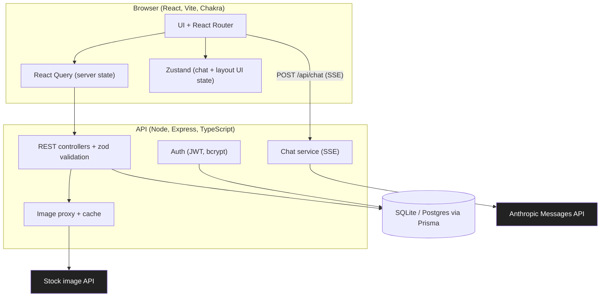
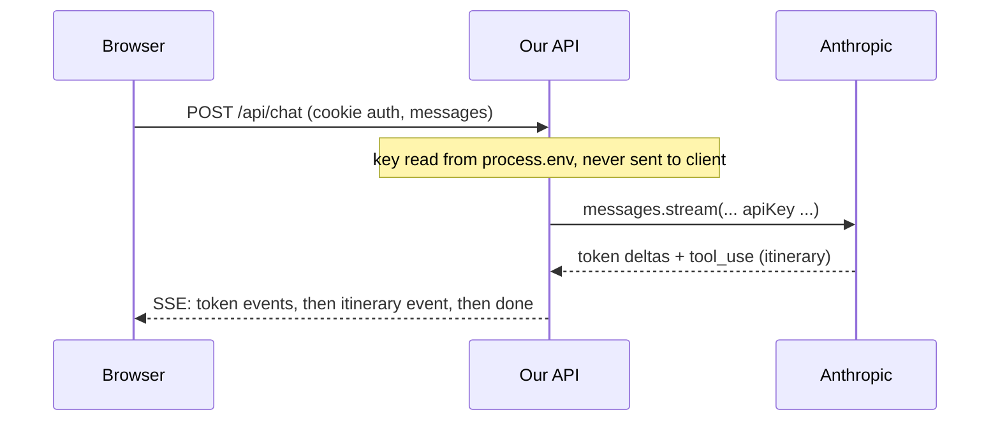
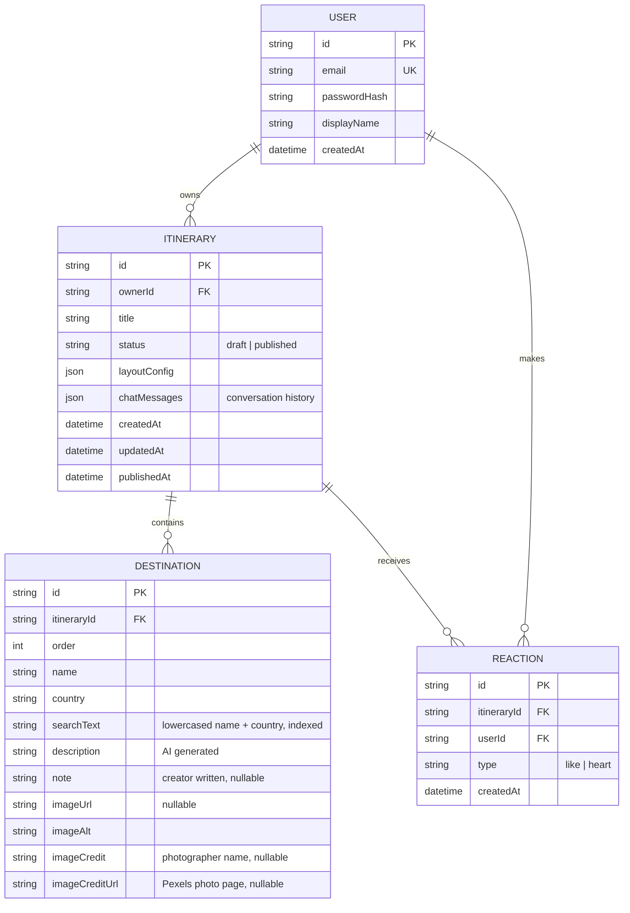
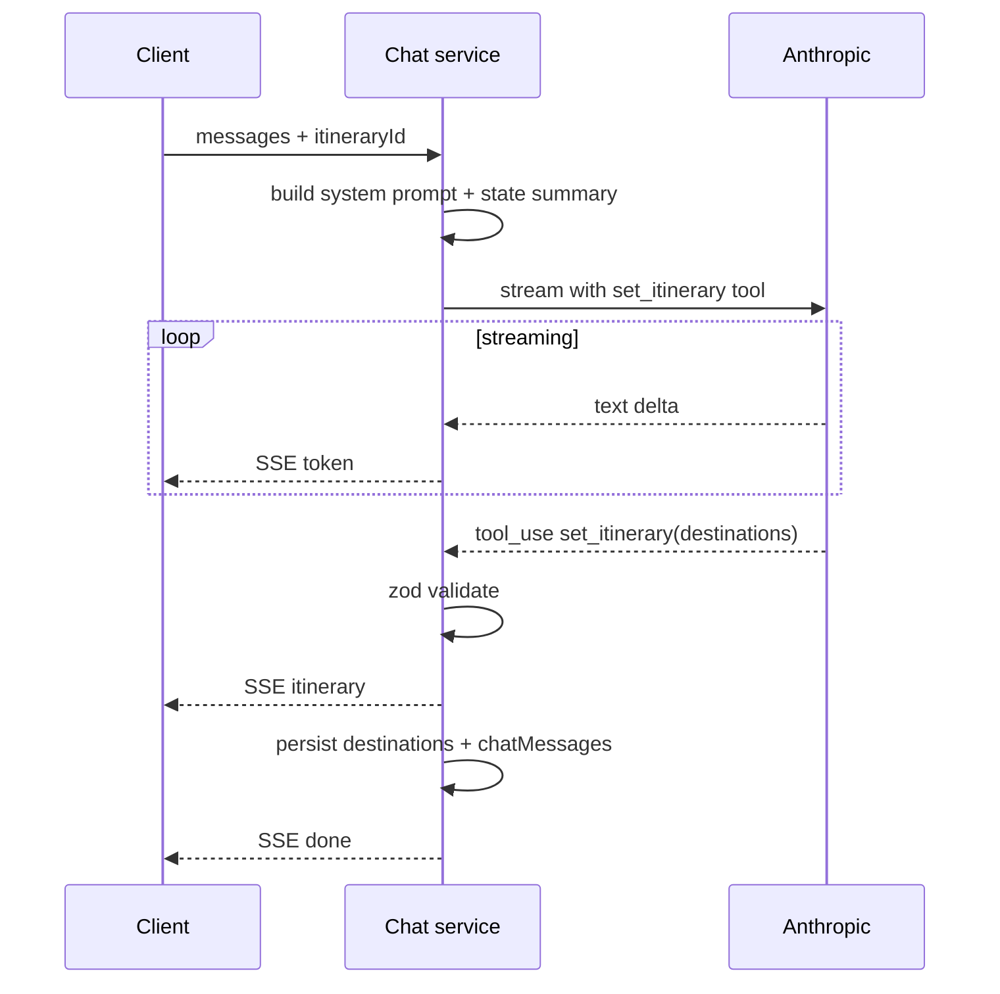
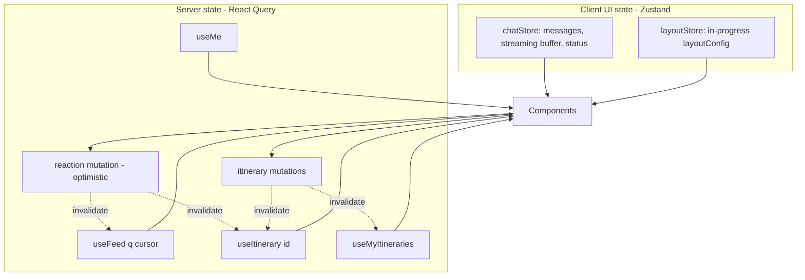
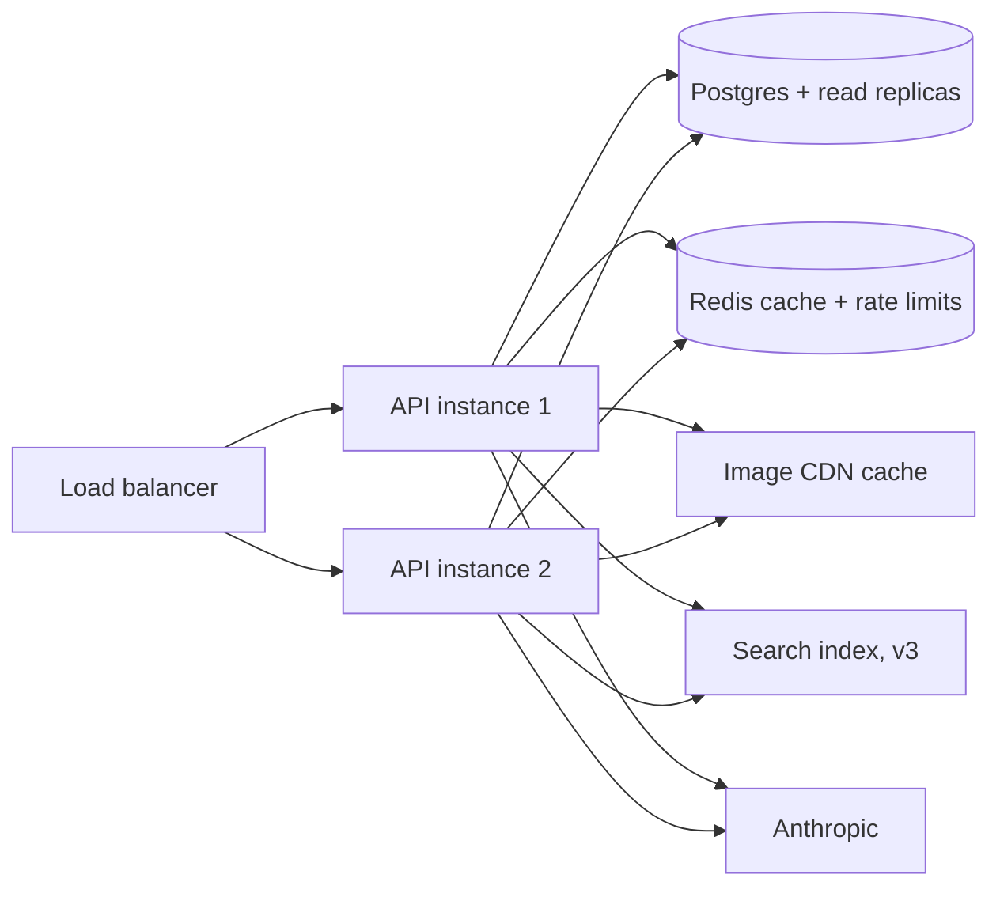

# Software Design Document: TravelItineraryBuilder

Conversational Travel Itinerary Builder and Sharing Feed. v1.

This is the source of truth for implementation. Pair it with `ux-flows.md`. Every decision below is numbered so it can be revised in isolation.

---

## 1. Scope

**In scope (v1)**
- Chat-driven itinerary creation and refinement against a real Anthropic endpoint.
- Per-destination creator notes.
- Layout and image-treatment customization before publishing.
- Public feed: browse, search by location, react with heart or like.
- Email plus password auth with itinerary ownership, edit and delete.
- Loading, empty and error states throughout. Responsive desktop to mobile.

**Out of scope (v1), documented for v2**
- OAuth sign-in (decision D6).
- Full comment threads on the feed.
- Following, notifications, rich profiles.
- Collaborative editing, drag-reorder, real-time multi-user.

---

## 2. Key decisions and tradeoffs

| # | Area | Decision | Rationale and tradeoff |
|---|---|---|---|
| D1 | Routing | **React Router data router (`createBrowserRouter`).** | Multi-view authed SPA. Gives route-level code splitting and loaders. |
| D2 | Client state | **Zustand, scoped to client UI state only.** | React Query owns all server state. Zustand holds ephemeral UI state the server should not know about: the in-flight chat conversation, the streaming buffer and the unsaved layout-editor config. Tradeoff: two state tools, but each has a crisp job so there is no overlap. |
| D3 | Formatting | **Prettier with `eslint-config-prettier`.** | ESLint handles correctness, Prettier handles formatting, and the config stops the two from fighting. |
| D4 | API style | **REST.** | The resource model is small and tree-shaped (users, itineraries, destinations, reactions). React Query is the data layer and end-to-end type safety comes from shared zod schemas (D5). Tradeoff: REST can over-fetch, mitigated by purpose-built endpoints. |
| D5 | Shared types | **Shared zod schemas in a workspace package.** | One source of truth. The backend validates requests and responses with the schema at runtime. The frontend imports the inferred types. No drift, plus runtime validation for free. |
| D6 | Auth | **Email plus password, JWT in an httpOnly cookie. OAuth deferred to v2.** | We need real identity to own, edit and delete itineraries and to attribute reactions. Email plus password with bcrypt and a signed JWT is real, minimal and demoable with no third-party setup. v2 adds Google OAuth as an additional provider on the same user table (section 13). |
| D7 | Chat transport | **Server-Sent Events.** | Chat is turn-based and the streaming is one-directional (server to client tokens). SSE is plain HTTP, proxy-friendly, auto-reconnecting and trivial to back with the Anthropic streaming SDK. The client sends each turn as a normal POST and reads the stream back. A stateful socket connection is reserved for v2 real-time multi-user features. |
| D8 | Datastore | **SQLite via Prisma for v1, Postgres swap for production.** | Zero infra, real persistence, runs from a single file so a reviewer can clone and run. Prisma keeps the provider swap to a one-line change. Weighed in 2.1. |
| D9 | Backend framework | **Express plus zod validation.** | Ubiquitous, well understood, and zod gives request validation plus shared types in one place. |

### 2.1 Datastore weighing (D8)

Kept brief because the two are closer than the one-liner implies. The call pivots on how v1 is evaluated.

| Favors SQLite | Favors Postgres |
|---|---|
| Zero infra, single file, clone-and-run offline | Production parity, you test what you ship |
| Fast isolated tests, fresh file per run | Concurrent writes via MVCC at scale |
| No service, account or Docker to stand up | Native case-insensitive plus trigram and full-text search |

**Why SQLite for now.** v1 is a self-contained build meant to run on a reviewer's machine, so removing all infra friction outweighs production parity at demo load. It is still a real relational database with foreign keys, unique constraints, cascade deletes, transactions and migrations, so ownership, authz and reaction integrity behave correctly. The Postgres wins (concurrent writes, richer search) do not bite at v1 volume.

**Keeping the swap cheap.** The one-line swap holds only if we stay engine-neutral. Avoid Prisma `mode: "insensitive"` which is Postgres only, and instead match on a normalized lowercase `searchText` field with `contains`. Keep JSON columns (`layoutConfig`, `chatMessages`) read-whole rather than queried inside. Constrain `status` and reaction `type` enums in zod at the app layer. With that discipline, moving to Postgres is three steps: set `provider` to `postgresql`, point `DATABASE_URL` at the instance, run `prisma migrate deploy`. Revisit if v1 ships as a deployed shared link rather than a cloned repo, in which case hosted Postgres such as Neon removes the swap entirely with no local service.

---

## 3. Assumptions

1. Images are not generated by the model. They are fetched by location name from Pexels and proxied through our backend, which holds that key too. This is the largest gap in the brief. See section 9.
2. The model returns the structured itinerary via tool use, so we get reliable typed JSON rather than parsing prose. See section 8.
3. A reaction requires login. Browsing and searching do not. This prevents trivial abuse and lets us attribute and de-duplicate reactions per user.
4. Editing a published itinerary updates the existing public post in place. There is no separate re-publish step and the URL is stable.
5. Search matches destination name or country and returns the parent itineraries. A single itinerary can surface under several locations.
6. One reaction of each type per user per itinerary. Reactions are toggles.
7. v1 runs as a single API process. Horizontal scale is designed for (section 12) but not deployed.

---

## 4. Architecture overview

A backend-for-frontend. The browser never sees the Anthropic key or the image-provider key. All model and image calls route through our API.



Key-security note: the two secrets (Anthropic key, image-provider key) exist only as server environment variables. No secret is ever shipped in the bundle, embedded in a URL or returned to the client. The client talks only to our API.



---

## 5. Repository layout

Yarn workspaces monorepo.

```
travel-itinerary-builder/
  package.json            (workspaces: apps/*, packages/*)
  packages/
    shared/               zod schemas + inferred TS types (the contract)
      src/schemas.ts
      src/types.ts
  apps/
    api/                  Express + Prisma + Anthropic
      prisma/schema.prisma
      src/routes/         auth, itineraries, feed, reactions, chat, images
      src/services/
      src/middleware/     auth, validate, rateLimit, error
      src/index.ts
    web/                  Vite + React + Chakra + React Query + Zustand
      src/routes/
      src/features/       feed, builder, customize, auth, me
      src/components/
      src/stores/         chatStore, layoutStore
      src/lib/            apiClient, queryClient, sse
```

The `shared` package is the spine. Both apps import schemas from it. Types never live in two places.

---

## 6. Data model



Constraints worth enforcing in Prisma:
- `REACTION` unique on `(itineraryId, userId, type)` so a toggle cannot double-count.
- `DESTINATION` and `REACTION` cascade-delete with their `ITINERARY`.
- `status` and reaction `type` are constrained enums.
- `chatMessages` and `layoutConfig` are JSON columns. Keeping the conversation on the itinerary lets a draft resume across devices and sessions.
- Index `ITINERARY` on `(publishedAt, id)` for the feed keyset order, and `DESTINATION` on `searchText` for location search.
- Reaction counts are derived per itinerary and type. For the feed hot path they may be denormalized onto the itinerary and updated on each reaction write to avoid an N+1.
- `DESTINATION.note` and the image fields are owned by the creator and the image service respectively, never written by the chat tool. Reconciliation (section 8) preserves them across refinements.
- Caps enforced in the shared schema: max destinations per itinerary, max itineraries per user, and max note and message length, to bound cost and storage.

`layoutConfig` shape:
```ts
type LayoutConfig = {
  textDensity: "compact" | "comfortable" | "spacious";
  cardSize: "sm" | "md" | "lg";
  imageCrop: "fill" | "fit";
  imageFocus: "top" | "center" | "bottom";
};
```

---

## 7. API contract

All bodies validated against shared zod schemas. Auth is a signed JWT in an httpOnly, SameSite=Lax cookie. `(auth)` means a valid session is required, `(owner)` means caller must own the resource.

**Auth**
| Method | Path | Body | Returns |
|---|---|---|---|
| POST | `/api/auth/signup` | email, password, displayName | user, sets cookie. 409 on duplicate email. Password minimum length enforced in the shared schema. |
| POST | `/api/auth/login` | email, password | user, sets cookie. 401 on bad credentials. |
| POST | `/api/auth/logout` | none | 204, clears cookie |
| GET | `/api/auth/me` | none | user or 401 |

**Itineraries**
| Method | Path | Auth | Notes |
|---|---|---|---|
| POST | `/api/itineraries` | auth | Creates an empty draft, returns it. |
| GET | `/api/itineraries/:id` | public if published, owner if draft | Full itinerary with destinations, plus `heartCount`, `likeCount` and `myReactions` when authed. |
| PATCH | `/api/itineraries/:id` | auth, owner | Owner-editable fields only: `title`, `layoutConfig`. Destination content is owned by the chat service, notes by the destination endpoint below. Touches `updatedAt`, never `publishedAt`. |
| PATCH | `/api/itineraries/:id/destinations/:destId` | auth, owner | Sets the creator `note` on one destination. The only client write path to a destination, so it cannot clobber AI-owned fields. |
| POST | `/api/itineraries/:id/publish` | auth, owner | Validates preconditions (non-empty `title`, at least one destination), flips `status` to published, stamps `publishedAt`. 422 if preconditions fail. |
| DELETE | `/api/itineraries/:id` | auth, owner | Cascades destinations and reactions. |
| GET | `/api/itineraries?mine=true` | auth | Caller's drafts and published. |

**Feed and reactions**
| Method | Path | Auth | Notes |
|---|---|---|---|
| GET | `/api/feed?q=&cursor=&limit=` | public | Published only, ordered `publishedAt` desc with `id` as tiebreak, keyset paginated on that key. `q` matches destination name or country. Each item carries cover, title, author, stop count, `heartCount`, `likeCount`, matched-destination ids and `myReactions` when authed. |
| POST | `/api/itineraries/:id/reactions` | auth | Body: type. Target must be published, else 404. Idempotent toggle on. Returns counts plus the caller's reaction state. |
| DELETE | `/api/itineraries/:id/reactions/:type` | auth | Toggle off. Returns counts. |

**Chat (SSE)**
| Method | Path | Auth | Notes |
|---|---|---|---|
| POST | `/api/chat` | auth, owner | Body: `itineraryId`, `userMessage` (the new turn only). The server loads prior history from the itinerary rather than trusting a client-sent transcript. Responds `text/event-stream`. |

SSE event protocol:
- `event: token` data: `{ "delta": "..." }` (assistant prose, streamed)
- `event: itinerary` data: `{ destinations: [...] }` (structured update after reconciliation, emitted once tool use resolves; `imageUrl` may be null at this point. A turn that only converses emits no itinerary event)
- `event: images` data: `{ updates: [{ destId, imageUrl, imageAlt, imageCredit, imageCreditUrl }] }` (sent after covers resolve, for new or changed destinations only)
- `event: done` data: `{ "messageId": "..." }`
- `event: error` data: `{ "message": "...", "code": "..." }` (codes cover upstream 429, 529, timeout, validation and unauthenticated)

**Images**
| Method | Path | Auth | Notes |
|---|---|---|---|
| GET | `/api/images?q=location` | auth | Server proxies Pexels, caches by normalized query, returns `{ url, alt, credit, creditUrl }`. |

---

## 8. AI integration

The chat must do two jobs at once: hold a natural conversation and emit a structured, typed itinerary. We separate these cleanly.

**Model configuration.** The build uses one Sonnet model with thinking off and low effort to keep cost down, defined as global constants so every chat call reads the same values.

```ts
// apps/api/src/config/anthropic.ts
export const CLAUDE_MODEL = "claude-sonnet-4-6";
export const CLAUDE_EFFORT = "low" as const;   // output_config.effort, the floor for Sonnet 4.6
export const CLAUDE_THINKING_ENABLED = false;  // false omits the thinking block, so no extended thinking
export const CLAUDE_MAX_TOKENS = 1500;         // per-turn output cap, tune to itinerary size
```

Applied to every Messages call:

```ts
const stream = anthropic.messages.stream({
  model: CLAUDE_MODEL,
  max_tokens: CLAUDE_MAX_TOKENS,
  output_config: { effort: CLAUDE_EFFORT },
  ...(CLAUDE_THINKING_ENABLED ? { thinking: { type: "adaptive" } } : {}),
  system: SYSTEM_PROMPT,
  tools: [SET_ITINERARY_TOOL],
  messages,
});
```

Three points that matter for cost and correctness:
- Thinking off means omitting the `thinking` block entirely. On Sonnet 4.6 extended thinking is opt-in, so no block means no thinking. There is no `thinking: off` flag.
- `effort` is `low`, `medium`, `high` or `max` on Sonnet 4.6, passed inside `output_config`. There is no `none`, so `low` is the floor and the cheapest. It cuts total token spend including tool calls, whether or not thinking is enabled.
- This is the reason to stay on Sonnet 4.6 rather than Sonnet 5: on the Claude 5 models thinking is always on and cannot be disabled, which would defeat the cost goal here.

**Transport.** The client POSTs only the new user turn to `/api/chat`. The server loads the persisted conversation for that itinerary, appends the new turn, then calls the Anthropic Messages API with streaming enabled and relays deltas to the browser as SSE `token` events. Loading history server-side means a client cannot forge the transcript, and it keeps the key server-side. Stored history is capped and older turns are summarized (see context control below).

**Structured output.** The model is given a `set_itinerary` tool whose input is a `title` plus a `destinations` array (each with name, country, description, order). It carries no note or image fields, since those belong to the creator and the image service, not the model. The system prompt instructs the model to converse normally and to call `set_itinerary` whenever the itinerary or title changes. Tool use yields validated JSON rather than prose we have to parse, which removes the classic fragility of "please reply in JSON". When the tool call resolves, the server validates it against the shared zod schema and emits an `itinerary` SSE event. If validation fails, the server drops the bad structured update, keeps the prose, and surfaces a soft retry rather than corrupting the draft. The user can also edit the proposed `title` directly, and a non-empty title is required to publish.

**Reconciliation (preserving notes and images).** The tool returns the full destination set every turn with AI-owned fields only, so the server merges it into the existing rows rather than replacing them. A blind replace would wipe every creator note and resolved cover on each refinement. The merge:
- Match each incoming destination to an existing row by normalized name (lowercased, trimmed).
- On a match, update the AI fields (description, country, order) and carry over the existing `note`, `imageUrl` and credit fields unchanged.
- For an incoming destination with no match, insert a new row with an empty note and queue it for image resolution.
- For an existing row no longer present, delete it along with its note.

Only new or changed destinations are queued for Pexels resolution, so unchanged covers neither flicker nor burn quota. The server emits `itinerary` immediately after the merge, then resolves queued covers and emits `images`.

**Context and cost control.**
- Cap conversation length. Beyond N turns, summarize older turns server-side before sending.
- Set a sensible `max_tokens` per turn: the `CLAUDE_MAX_TOKENS` constant above.
- Per-user rate limit on `/api/chat` (token bucket) to bound spend and abuse.
- The itinerary lives in the DB, so we send a compact current-state summary plus recent turns rather than the entire transcript every time.
- Hard caps enforced in the shared schema: max destinations per itinerary, max itineraries per user, and max note and message length.

**Prompt strategy (server-owned).** A fixed system prompt defines the assistant's role, the tool, the expected destination fields (name, country, description, order) and the rule that creator notes are user-authored and must never be invented by the model. Keeping the prompt server-side means the client cannot tamper with it.



---

## 9. Image strategy (the unaddressed gap)

The brief asks for image crop and sizing controls and image-failure handling but never states where images come from. The model does not produce images. Decision:

1. When the itinerary updates, the server resolves a cover image per destination by querying Pexels (`GET /v1/search`, `per_page=1`, `orientation=landscape`) with the destination name plus country. The Pexels key is server-side only. Results are cached by normalized lowercase query so repeat locations are free and the 200/hour and 20,000/month limits are respected.
2. Resolution runs only for new or changed destinations (per the reconciliation in section 8), after the `itinerary` SSE event rather than inline with it. The itinerary renders immediately with placeholders, then covers arrive via the `images` event. This keeps the turn fast, avoids re-resolving stable covers and stops a destination's photo changing on every edit.
3. The image URL, alt text, photographer name and photo-page URL are stored on the destination. The client renders from our stored URL, not from a client-side provider call.
4. Pexels asks for attribution, so the detail view renders a small credit line ("Photo by NAME on Pexels", linking to the photo page) using the stored `imageCredit` and `imageCreditUrl`. Feed cards expose the same credit to assistive tech to avoid cluttering the dense grid. This is a license requirement, not optional polish.
5. Every image element reserves width and height to prevent layout shift, lazy-loads below the fold, and has an `onError` deterministic fallback: a colored block derived from a hash of the location name with the location initial centered. A broken or slow image never shows a broken-image glyph and never collapses layout.

This makes the crop and focal controls meaningful (they operate on a real cover image) and makes failure handling a designed state rather than an afterthought. License note: Pexels content is free for commercial use, which a public feed needs, and their terms ask that you not rebuild a competing photo library, which this app does not.

---

## 10. State management

Clean split. No overlap, which keeps cache invalidation simple.



- **React Query** owns everything the server is authoritative for: the current user, the feed, an itinerary, the caller's itineraries and all mutations. Reactions are optimistic with rollback. Feed and itinerary queries are invalidated on relevant mutations.
- **Zustand** owns only ephemeral UI state: the live chat conversation and streaming buffer, and the unsaved layout config in the customize editor. These reset when the user leaves the flow. Once a turn completes, the durable result (destinations, chatMessages) is persisted through a React Query mutation and the Zustand buffer is cleared.
- **Auth state** is the `useMe` query plus the httpOnly cookie. There is no token in JS, so there is no auth store to keep in sync.

---

## 11. Security

- **Secrets server-side only.** Anthropic and image keys are env vars on the API. Never bundled, never in URLs, never returned to the client.
- **Sessions.** JWT signed server-side, delivered in an httpOnly, SameSite=Lax, Secure cookie. No token in localStorage, which removes the common XSS token-theft path.
- **CSRF.** State-changing requests are cookie-authenticated, so `SameSite=Lax` is the primary mitigation: it withholds the cookie on cross-site POST while allowing top-level navigations. A double-submit CSRF token is the defense-in-depth option if the threat model warrants it.
- **Passwords.** bcrypt with a sane cost. Never logged.
- **Input validation.** Every endpoint validates its body and params against the shared zod schema before touching the DB.
- **Output sanitization.** Both AI-generated descriptions and creator notes are rendered as text, and any HTML path is sanitized with DOMPurify. Treat model output as untrusted.
- **Authorization.** Ownership checks on every write. A draft is only readable by its owner. Editing or deleting another user's itinerary returns 403.
- **Rate limiting.** Per-user limits on `/api/chat` and `/api/images` to bound cost and abuse. Global IP limit on auth endpoints.
- **DB safety.** Prisma parameterizes all queries.
- **CORS.** Locked to the web origin. Credentials enabled for the cookie.

---

## 12. Scalability

v1 runs as one process and one SQLite file. The design scales without a rewrite.



- **Stateless API.** JWT sessions mean any instance serves any request, so we scale horizontally behind a load balancer.
- **Database.** Swap SQLite for Postgres via the Prisma provider. Read replicas absorb feed reads. The feed is the hot read path.
- **Feed pagination.** Keyset (cursor) pagination, not offset, so deep pages stay fast.
- **Search.** v1 matches on a normalized `searchText` field (`contains`), which works identically on SQLite and Postgres. On the Postgres swap this upgrades to a trigram or full-text index for ranked fuzzy matching. At larger scale move to a dedicated index (Algolia or Elasticsearch) populated on publish. The API contract does not change at any step.
- **Caching.** Redis for the image-lookup cache and rate-limit counters. Image bytes sit behind a CDN.
- **AI cost.** Conversation summarization, max-token caps and per-user rate limits bound spend. Heavy or batch AI work would move behind a queue.
- **SSE.** Fine on a single instance per connection. At scale, terminate streams on a dedicated tier and keep CRUD on the stateless API.

---

## 13. v2 plan: auth and OAuth

v1 ships email plus password. v2 adds OAuth as an additional sign-in on the same user identity.

- Add an `AuthProvider` table or columns: `provider` (`local` or `google`), `providerId`, with `passwordHash` nullable for OAuth-only users.
- Add Google OAuth with PKCE. On callback, find-or-create the user by verified email, then issue the same JWT cookie. Nothing downstream changes because the session mechanism is unchanged.
- This is purely additive. No data migration beyond the new provider fields. The decision to defer is deliberate: it keeps v1 dependency-free and demoable while leaving a clean seam.

---

## 14. Edge cases

Surfaced here because several are not in the brief. These belong in the build acceptance criteria.

**AI and streaming**
- Anthropic timeout, 429 rate limit or 529 overloaded: surface an inline retry on the failed turn, preserve the conversation.
- Stream drops mid-reply: keep partial prose, mark the turn incomplete, offer retry.
- Structured tool output fails zod validation: keep the prose, discard the bad itinerary update, soft retry. Never corrupt the saved draft.
- Model invents a nonexistent place: acceptable as creative content, but image lookup must fall back gracefully (section 9).
- User refreshes or navigates away mid-stream: the draft (chatMessages plus destinations) is persisted per completed turn, so reload resumes from the last good state.
- Session expires mid-build: the next `/api/chat` returns 401, the client routes to login and returns to the draft, which is server-saved so nothing is lost.
- Very long conversations: summarize older turns to stay under context and cost limits.

**Concurrency and lifecycle**
- Publishing an empty or untitled draft: blocked. Publish requires a non-empty title and at least one destination, returns 422 otherwise, and the UI disables the control until both hold.
- Refining a published or draft itinerary: reconciliation by normalized name preserves notes and covers on unchanged stops, drops them only for removed stops (section 8).
- Editing a published itinerary while others view it: writes update in place, reads always reflect the latest published version.
- Same itinerary edited from two devices: last write wins on PATCH, scoped to the fields sent. Acceptable for v1, documented.
- Deleting an itinerary that has reactions or is open in someone's tab: cascade reactions, return 404 on the stale detail view with a friendly not-found state.

**Reactions**
- Double tap or rapid toggle: unique constraint plus idempotent endpoints keep counts correct. Optimistic UI reconciles with the server count.
- Reacting while logged out: route to login, return with the intended reaction.
- Reacting to your own itinerary: allowed in v1, documented.
- Reacting to a draft or deleted itinerary: 404, since only published itineraries are reactable.

**Search and feed**
- Empty query: default feed. No results: dedicated empty state.
- A location appears in many itineraries: each parent itinerary is returned once, with the matched destination highlighted on open.
- Case and accents (Sao Paulo vs São Paulo): normalize on index and query.
- Large feed: keyset pagination plus optional list virtualization.

**Auth and authz**
- Expired or missing cookie on a write: 401, client redirects to login and returns.
- Draft accessed by a non-owner: 403 or not-found, never leaked content.
- Signup with an existing email: 409, surfaced as a field-level error on the form.

**Rendering and content**
- Broken or slow images: deterministic fallback, reserved dimensions (section 9).
- Malicious content in notes or model output: sanitized before render.
- Extremely long titles, notes or destination lists: schema caps reject oversize input with 422, and the layout controls clamp and truncate what does render.

---

## 15. Performance

- **Code splitting** by route via the data router. The chat builder, the customize editor and the Anthropic-touching paths load on demand. The Anthropic SDK lives only on the server, so it adds zero client weight.
- **LCP:** feed card images reserve dimensions and lazy-load. Skeletons paint immediately so the page is interactive fast.
- **CLS:** every image and async block reserves space.
- **Search** is debounced and reflected in the URL.
- **Bundle:** Chakra is tree-shaken, icons imported individually, route-level lazy boundaries. Run a bundle analyzer in CI.
- **React Query** caches the feed and itineraries, prefetches an itinerary on card hover, and dedupes in-flight requests.

---

## 16. Testing (last priority per the brief)

React Testing Library plus MSW to mock the API. Priority order if time is short:
1. Reaction button: optimistic toggle and rollback on error.
2. Feed search: debounced filtering and empty state.
3. Chat message list: renders streamed tokens and an itinerary update.
4. Layout controls: changing a control updates the live preview.
5. Auth guard: protected routes redirect when unauthenticated.

A couple of API integration tests cover the create-to-publish path and ownership enforcement.

---

## 17. Build plan: phases and steps

Hand this section to Claude Code phase by phase. Each phase has an acceptance bar.

**Phase 0: Scaffold and tooling**
- Yarn workspaces. `packages/shared`, `apps/api`, `apps/web`.
- TypeScript project references, ESLint, Prettier with `eslint-config-prettier`.
- Vite plus React plus Chakra in `web`. Express in `api`. Prisma with SQLite.
- Accept: both apps boot, `shared` imports work both ways, lint passes.

**Phase 1: Shared contract and data layer**
- zod schemas and inferred types in `shared`: User, Itinerary, Destination, Reaction, LayoutConfig, ChatMessage, API request and response shapes.
- Prisma schema matching section 6, migrations, seed script.
- Accept: schemas import in both apps, DB migrates, seed runs.

**Phase 2: Auth**
- API: signup, login, logout, me. bcrypt, JWT httpOnly cookie, auth middleware.
- Web: `/login`, `useMe`, protected-route wrapper, top-bar avatar menu.
- Accept: sign up, log in, refresh stays logged in, protected routes redirect.

**Phase 3: AI chat with streaming**
- API: `/api/chat` with the Anthropic SDK, server-owned history, system prompt, `set_itinerary` tool (title plus destinations), SSE relay, zod validation, destination reconciliation that preserves notes and images, persistence of chatMessages and destinations.
- Web: `/build` two-panel UI, chatStore, SSE client, streaming bubble, live itinerary panel.
- Accept: a real conversation streams in and builds a structured itinerary that persists, and refining it (swap or reorder a stop) preserves existing notes and covers.

**Phase 4: Itinerary CRUD and My itineraries**
- API: create, get, patch, delete, list-mine with ownership checks.
- Web: `/me`, resume draft at `/build/:id`, delete with confirm.
- Accept: drafts persist, resume works, owner-only edit and delete enforced.

**Phase 5: Per-destination notes**
- API: `PATCH /api/itineraries/:id/destinations/:destId` for the note only.
- Web: inline note editor on each destination card, autosave on blur.
- Accept: notes save, survive reload and AI refinement, render distinctly from AI text.

**Phase 6: Image resolution and fallback**
- API: Pexels proxy plus cache, resolve covers for new or changed destinations only, emit the `images` SSE event, store url, alt and credit fields.
- Web: image component with reserved dimensions, lazy load, deterministic fallback, credit line on detail.
- Accept: real images appear without blocking the itinerary, unchanged covers do not flicker, failures fall back cleanly, no layout shift.

**Phase 7: Customize and publish**
- Web: `/build/:id/customize`, layoutStore, live preview, controls from `ux-flows.md`, Publish disabled until a title and at least one destination exist.
- API: `POST /api/itineraries/:id/publish` validates preconditions, flips status and stamps publishedAt; `PATCH` saves layoutConfig.
- Accept: layout config persists, the public view honors it, and an empty or untitled draft cannot be published.

**Phase 8: Public feed, detail and search**
- API: `/api/feed` ordered by publishedAt desc with keyset pagination, location search, reaction counts and caller reaction state on each item.
- Web: feed grid, detail view, debounced URL-synced search, skeletons and empty states.
- Accept: published itineraries appear newest first, search filters by location and opens the parent at the matched stop, counts render correctly.

**Phase 9: Reactions**
- API: toggle endpoints with the unique constraint, gated to published itineraries.
- Web: optimistic heart and like with rollback, login redirect when logged out.
- Accept: counts are correct under rapid toggling, optimistic UI reconciles, reactions on non-published targets are rejected.

**Phase 10: Polish**
- Responsive passes (builder split-to-tabs on mobile), transitions, all loading, empty and error states, rate limiting, sanitization, accessibility.
- Accept: clean desktop to mobile, no broken images, graceful AI and network failures.

**Phase 11: Tests (if time remains)**
- The RTL and integration suite from section 16.
