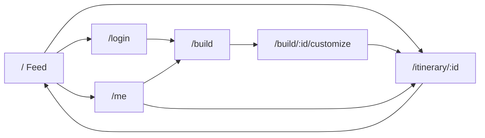

# UX Design and User Flows

Conversational Travel Itinerary Builder and Sharing Feed (v1)

This is step one. It defines screens, states, transitions and flows. The architecture, schema and build plan live in `design.md`.

---

## 1. Design principles

1. **Chat is the create surface, feed is the consume surface.** Two distinct mental modes. Never blend them on one screen.
2. **Every async surface has four states.** Loading (skeleton), empty, error, success. No bare spinners on primary content.
3. **The itinerary is always visible while building.** Chat on one side, the live itinerary preview on the other. The user sees structure forming as they talk.
4. **Edit is non-destructive until publish.** Drafts are private. Publishing is an explicit, reversible action.
5. **Read is public, write requires identity.** Anyone can browse and search the feed. Reacting, creating, editing and deleting require login.

---

## 2. Information architecture

```
/                       Feed (public, default landing)
/login                  Auth (login + signup tabs)
/build                  Chat itinerary builder (auth)
/build/:id              Resume building an existing draft (auth)
/build/:id/customize    Layout and sizing editor + preview (auth)
/me                     My itineraries: drafts + published, edit/delete (auth)
/itinerary/:id          Public itinerary detail (public if published, owner-only if draft)
```

Navigation model: a persistent top bar (logo to feed, search, "Create", avatar menu). On mobile the search collapses to an icon and "Create" becomes a floating action button.



---

## 3. Screen specs

Each screen lists its states and a wireframe. Wireframes are desktop unless noted. Responsive behavior is in section 5.

### 3.1 Auth (`/login`)

Single screen, tabbed Login / Sign up. Email plus password. Sign up also takes a display name (shown on the feed). v1 has no OAuth. See `design.md` for the v2 plan.

```
+--------------------------------------+
|        TravelItineraryBuilder        |
|   [ Login ]   [ Sign up ]            |
|                                      |
|   Email     [____________________]   |
|   Password  [____________________]   |
|   (signup)  Display name [________]  |
|                                      |
|            [   Continue   ]          |
|   error: "Email or password wrong"   |
+--------------------------------------+
```

States: idle, submitting (button spinner, inputs locked), field-level validation errors, auth error banner. On success redirect to the intended route or `/`.

### 3.2 Feed (`/`)

Public landing. A searchable, reactable grid of published itineraries. Each itinerary renders as a card showing its cover destination plus a destination count, author, title and reaction counts.

```
+---------------------------------------------------------------+
| TravelItineraryBuilder    [ search... ]    [Create]    (avatar)|
+---------------------------------------------------------------+
|  Results for "lisbon"  (12)                                    |
|  +-------------+  +-------------+  +-------------+              |
|  | [  img   ] |  | [  img   ] |  | [  img   ] |               |
|  | Lisbon...  |  | Iberia 10d |  | South EU   |               |
|  | 4 stops    |  | 6 stops    |  | 8 stops    |               |
|  | by Ana     |  | by Marco   |  | by Priya   |               |
|  | hrt 24 lk 9|  | hrt 11 lk 3|  | hrt 40 lk20|               |
|  +-------------+  +-------------+  +-------------+              |
|  ... (cursor-paginated / infinite scroll)                     |
+---------------------------------------------------------------+
```

States:
- **Loading:** a grid of card skeletons (image block, two text bars, a reaction bar). Skeleton count matches the typical first page so layout does not jump.
- **Empty (no posts yet):** illustration plus "No itineraries yet. Be the first to create one." CTA to `/build`.
- **Empty (no search results):** "No itineraries mention 'xyz'. Try a city or country." with a clear-search action.
- **Error:** inline retry card, feed stays navigable.

Search behavior: debounced 300ms, matches destination name or country across all published itineraries, returns the parent itineraries. Clicking a result opens the full itinerary, scrolled to the matched destination. Search reflects in the URL (`/?q=lisbon`) so results are shareable and back-button friendly.

Reactions: heart and like, each a toggle. A reaction the current user has already given renders in its active state, the rest inactive, both with counts. Optimistic update on tap with rollback on failure. Tapping while logged out routes to `/login` and returns the user to the feed with the intended reaction preserved as a hint.

### 3.3 Itinerary detail (`/itinerary/:id`)

Read view of a full itinerary. Honors the creator's saved layout config (text density, card size, image crop). Destinations render in order, each with its image, the AI-generated description and the creator's personal note if present.

```
+---------------------------------------------------------------+
|  < back to feed                                               |
|  Iberia in 10 Days            by Ana   hrt 24   lk 9          |
|  -----------------------------------------------------------  |
|  1. Lisbon, Portugal                                          |
|     [   image   ]   Old-town trams, miradouros and...         |
|     Photo by A. Reyes on Pexels                               |
|     Creator note: "Stay in Alfama, skip the tram queue."      |
|  -----------------------------------------------------------  |
|  2. Sintra, Portugal                                          |
|     [   image   ]   Palaces in the hills, half-day trip...    |
|  -----------------------------------------------------------  |
|  ... reactions bar pinned on scroll ...                       |
+---------------------------------------------------------------+
```

States: loading (header skeleton plus destination skeletons), success, not-found (deleted or never existed), forbidden (a draft viewed by a non-owner). If the viewer is the owner, an "Edit" affordance routes into `/build/:id`.

Image and credit: every image has a deterministic fallback (a colored block keyed to the location name with the location initial), and a "Photo by NAME on Pexels" credit renders under it linking to the photo page. No broken-image icons ever render. See section 6.

### 3.4 Chat itinerary builder (`/build`, `/build/:id`)

The core experience. Two panels. Left: turn-based chat with the AI. Right: the live itinerary forming from the conversation. On mobile these become two tabs.

```
+-------------------------------+-------------------------------+
|  CHAT                         |  ITINERARY (live)             |
|                               |  Iberia in 10 Days   [edit ✎] |
|  AI: Where to and how long?   |  ---------------------------- |
|  You: 10 days, Spain+Portugal |  1. Lisbon  [img] ✎note       |
|  AI: streaming reply...•••     |  2. Sintra  [img] ✎note       |
|                               |  3. Madrid  [img] ✎note       |
|  [ type a message...   ] (>)  |  [ Customize and publish > ]  |
+-------------------------------+-------------------------------+
```

Interaction model:
- User sends a message. The send button disables and an assistant bubble appears with a typing indicator.
- The assistant reply **streams token by token** (see `design.md`, SSE design).
- When a turn completes, the structured itinerary on the right updates: new destinations animate in, changed ones highlight briefly.
- The user keeps refining by chatting ("swap Madrid for Seville", "add two days in Porto"). Each refinement re-renders the right panel, and notes plus covers on unchanged stops carry through untouched.

Per-destination notes (in-panel): each destination card has a note affordance. Clicking opens an inline editor (textarea) scoped to that destination. Notes are the creator's own words, kept separate from AI text both visually and in the schema. Notes autosave on blur to the draft.

States:
- **First load (empty chat):** a friendly prompt plus 3 starter chips ("Weekend city break", "2-week road trip", "Beach and food").
- **Streaming:** assistant bubble shows live tokens, send disabled, a stop control available.
- **Itinerary updating:** the right panel shows a subtle shimmer on the cards being rewritten, not a full-panel spinner.
- **AI error:** the failed assistant turn shows an inline "Couldn't reach the assistant. Retry." that re-sends the last user message. Prior conversation is preserved.
- **Rate limited:** if the user sends too fast, an inline "Slow down a moment" note appears with send briefly disabled, rather than a hard error.
- **Session expired:** if auth lapses mid-build, the next send routes to login with a "Session expired, sign back in" note, then returns to the draft, which is saved server-side so nothing is lost.
- **Draft autosave:** a quiet "Saved" indicator. On navigation away or refresh the draft is recoverable from `/me` and `/build/:id`.

Transition out: "Customize and publish" routes to `/build/:id/customize`. The chat draft state is persisted server-side first so nothing is lost.

### 3.5 Layout and sizing editor (`/build/:id/customize`)

A live preview of the public card and detail view with controls to adjust presentation. Controls change a `layoutConfig` object, not the content.

```
+-------------------------------+-------------------------------+
|  CONTROLS                     |  PREVIEW (renders as public)  |
|  Text density   [S][M][L]     |  +-------------------------+  |
|  Card size      [sm][md][lg]  |  | [   image (cropped)  ] |  |
|  Image crop     [fill][fit]   |  | Lisbon, Portugal        | |
|  Image position [top][ctr]    |  | Old-town trams and...   | |
|                               |  | note: stay in Alfama    | |
|  [ < back ]   [ Publish > ]   |  +-------------------------+  |
+-------------------------------+-------------------------------+
```

Controls (v1, intentionally small set):
- **Text density:** compact / comfortable / spacious. Maps to font scale plus line height plus description truncation length.
- **Card size:** small / medium / large grid footprint on the feed.
- **Image crop:** fill (cover, may crop) or fit (contain, letterboxed).
- **Image focal position:** top / center / bottom for the cover crop.

The preview updates instantly (pure client state) and matches exactly what the feed and detail views will render. Publish is disabled until the itinerary has a title and at least one destination, with a hint explaining why. Publishing writes `layoutConfig`, flips status to `published` and stamps the publish time.

States: loading the draft, live editing (no async), publish submitting, publish success (toast plus redirect to `/itinerary/:id`), publish error (retain edits, inline retry).

### 3.6 My itineraries (`/me`)

Management surface. Two sections: Drafts and Published. Each row supports resume/edit, view and delete.

```
+---------------------------------------------------------------+
|  My itineraries                                               |
|  DRAFTS                                                       |
|   • Iberia in 10 Days   (3 stops)   [Resume]   [Delete]       |
|  PUBLISHED                                                    |
|   • Japan Spring        (6 stops)   [Edit] [View] [Delete]    |
|     hrt 24  lk 9                                              |
+---------------------------------------------------------------+
```

Editing a published itinerary reopens `/build/:id`. Saved changes update the live public post in place (no re-publish step, no new URL). Delete asks for confirmation and cascades reactions. States: loading skeleton rows, empty ("You haven't created any itineraries"), delete confirming, delete error.

---

## 4. Primary flows

### 4.1 Create and publish

```mermaid
flowchart TD
    A[Login] --> B[/build]
    B --> C[Send message to AI]
    C --> D[AI streams reply, itinerary updates]
    D --> E{Happy?}
    E -- No --> C
    E -- Yes --> F[Add per-destination notes]
    F --> G[/customize: adjust layout]
    G --> H[Publish]
    H --> I[/itinerary/:id public]
```

### 4.2 Browse, search and react

```mermaid
flowchart TD
    A[/ Feed] --> B{Search?}
    B -- Yes --> C[Type location, debounced]
    C --> D[Filtered cards]
    B -- No --> E[Default feed]
    D --> F[Open itinerary]
    E --> F
    F --> G{Logged in?}
    G -- Yes --> H[React: heart or like, optimistic]
    G -- No --> I[Route to login, return with intent]
```

### 4.3 Edit and delete

```mermaid
flowchart TD
    A[/me] --> B{Action}
    B -- Edit --> C[/build/:id]
    C --> D[Refine via chat or notes]
    D --> E[Save: live post updates]
    B -- Delete --> F[Confirm]
    F --> G[Cascade reactions, remove from feed]
```

---

## 5. Responsive behavior

Three breakpoints: desktop (>=1024), tablet (768 to 1023), mobile (<768).

| Surface | Desktop | Tablet | Mobile |
|---|---|---|---|
| Feed grid | 3 to 4 columns | 2 columns | 1 column |
| Builder | side-by-side chat and itinerary | side-by-side, narrower | two tabs: Chat / Itinerary |
| Customize | controls left, preview right | stacked, controls on top | stacked, sticky publish bar |
| Detail | centered single column, max width | same | same, full bleed images |
| Top bar | full search inline | full search inline | search icon expands, Create becomes FAB |

The builder split-to-tabs on mobile is the most important responsive decision. Two panels do not fit a phone, so chat and the live itinerary become a segmented control with a badge on the itinerary tab when it updates while the user is in chat.

---

## 6. Cross-cutting UX patterns

**Loading (skeletons preferred).** Feed cards, itinerary detail and `/me` rows all use shaped skeletons sized to the real content to avoid layout shift. The chat uses a typing indicator, not a skeleton, because the content is conversational.

**Images and attribution.** Images are sourced by location name from Pexels, proxied through our backend (see `design.md` section 9). Every image element has:
1. width and height reserved up front to prevent cumulative layout shift,
2. lazy loading below the fold,
3. an `onError` fallback to a deterministic colored block keyed to the location string, with the location initial centered.

A broken or slow image never shows a browser broken-image glyph and never collapses the layout. Pexels attribution is a license requirement: the detail view shows a small "Photo by NAME on Pexels" credit under each image, and feed cards expose the same credit to assistive tech without cluttering the dense grid. While building, a destination's cover can arrive a moment after its card, so the placeholder block holds until the image resolves.

**Transitions.** Chat to customize and customize to published are forward motions with a brief slide. The "Customize and publish" action persists the draft before navigating so a mid-transition failure loses nothing. Reaction taps animate the icon (scale pop) immediately, independent of the network round trip.

**Optimistic updates.** Reactions update the count and icon state on tap, then reconcile with the server response and roll back on error with a quiet toast.

**Empty states.** Every list has a purpose-built empty state with a next action, never a blank screen.

**Accessibility.** Full keyboard path through chat, feed and reactions. Streaming assistant text and the updating itinerary panel sit in `aria-live="polite"` regions so screen readers hear new content without losing focus. Reaction buttons expose pressed state and counts to assistive tech. Images carry alt text from the location name. Focus moves to new content on route change. Color is never the only signal for reaction state.

---

## 7. Design language

Direction: editorial travel, photography forward. The product is a feed of destination photos, so the chrome stays neutral and warm and lets the imagery carry the color. The feel borrows from print travel writing: a serif for titles, hairline rules between sections, generous whitespace, one restrained accent. This reads as intentional immediately and differentiates from default Chakra without costing build time. Swap the direction if you want, the tokens below are the only thing that changes.

v1 is light mode only. The tokens are semantic, so a dark theme is a later addition rather than a rework.

### Color

Warm paper surfaces, near-black warm ink, one teal accent, two distinct reaction colors.

| Token | Hex | Use |
|---|---|---|
| paper | #FAF8F4 | app background |
| surface | #FFFFFF | cards, inputs, sheets |
| ink | #1B1714 | primary text, primary buttons |
| muted | #6E665B | secondary text, meta, counts |
| subtle | #9C9488 | placeholders, disabled |
| hairline | #E8E2D8 | borders, dividers |
| accent | #0F6F6A | links, active, focus ring, like reaction |
| accentEmphasis | #0B5A56 | accent hover and pressed |
| heart | #E0244E | heart reaction active |
| danger | #B23A2E | errors and destructive, kept distinct from heart |
| success | #2F7D55 | save confirmations |

Heart rose and like teal sit far apart in hue on purpose, so the two reactions never read as the same control.

### Typography

Two families. A serif for character, a sans for UI.
- Display and titles: Fraunces (variable serif). Itinerary titles, screen headers, destination names.
- Body and UI: Inter. Everything else.

Scale (rem, line height):
- display-lg 2.5 / 1.1: detail-view itinerary title
- display-md 1.75 / 1.15: screen titles
- title 1.25 / 1.3: card titles and destination names (serif)
- body 1.0 / 1.55: descriptions and notes
- small 0.875 / 1.5: author, meta, reaction counts
- micro 0.75 / 1.4: photo credit, field labels

Weights: Fraunces 500 and 600, Inter 400, 500 and 600.

Self-host the fonts to avoid an external request and layout shift: `yarn add @fontsource-variable/fraunces @fontsource/inter` and import the used weights. This ties into the CLS goal in `design.md`. The family string in the theme must match what the chosen package registers (the variable package registers "Fraunces Variable").

### Density, card size, image crop

These map the existing `layoutConfig` controls (`design.md` section 6) to concrete values:
- textDensity: compact = body 0.9375rem, line 1.45, description clamp 2 lines. comfortable = body 1rem, line 1.55, clamp 3. spacious = body 1.0625rem, line 1.65, clamp 4.
- cardSize: sm = one extra grid column and a shorter cover. md = default. lg = one fewer column and a taller cover.
- imageCrop: fill = object-fit cover with the saved focal position. fit = object-fit contain on a paper letterbox.

### Spacing, radius, elevation

- Spacing: Chakra 4px base. Common steps 8, 12, 16, 24, 32, 48. Comfortable section padding, do not crowd.
- Radius: sm 4px (inputs, chips), md 8px (cards, images), lg 12px (sheets, modals). Buttons 6px. Modest rather than pill-round, to keep the editorial feel.
- Elevation: rest state is a 1px hairline border and no shadow. Hover and raised use `0 2px 8px rgba(27,23,20,0.08)`. Overlays use `0 12px 32px rgba(27,23,20,0.16)`. Prefer hairline dividers over boxed shadows wherever it reads cleanly.

### Motion

- Default transition 160ms ease-out.
- Reaction tap: the icon pops scale 1 to 1.2 to 1 over about 200ms and fills to heart or like.
- Card hover: translateY -2px plus the raised shadow over 160ms.
- Streaming tokens and itinerary card updates: 120ms fade-in.
- Respect `prefers-reduced-motion`: drop transforms, keep opacity only.

### Component conventions

- Cards: surface fill, 1px hairline, radius md, cover image full-bleed at the top, serif title, meta in small muted, reaction bar at the foot, hover lift.
- Buttons: primary is an ink fill with paper text, not a blue button. Secondary is a hairline outline with ink text. Tertiary and links are accent text. Destructive is danger text or outline. Radius 6px.
- Inputs and search: surface fill, hairline border, accent focus ring 2px. Search is a rounded field in the top bar.
- Skeletons: a warm shimmer between paper and hairline, never cold gray, shaped to the real content.
- Reaction buttons: outline icon in muted at rest, filled in heart or like when active, count in small muted, pop on toggle, pressed state exposed to assistive tech.
- Detail view: hairline rules between destinations, near-full-bleed images, the micro photo credit directly under each image.
- Empty states: centered, serif headline, muted body, a single primary action.

### Chakra theme

Targets Chakra v3 (`createSystem`). If the project pins v2, the same token values go into `extendTheme`. Claude Code should match the installed version.

```ts
// apps/web/src/theme.ts
import { createSystem, defaultConfig, defineConfig } from "@chakra-ui/react";

const config = defineConfig({
  theme: {
    tokens: {
      colors: {
        paper:          { value: "#FAF8F4" },
        surface:        { value: "#FFFFFF" },
        ink:            { value: "#1B1714" },
        muted:          { value: "#6E665B" },
        subtle:         { value: "#9C9488" },
        hairline:       { value: "#E8E2D8" },
        accent:         { value: "#0F6F6A" },
        accentEmphasis: { value: "#0B5A56" },
        heart:          { value: "#E0244E" },
        danger:         { value: "#B23A2E" },
        success:        { value: "#2F7D55" },
      },
      fonts: {
        heading: { value: "'Fraunces Variable', Georgia, serif" },
        body:    { value: "'Inter', system-ui, sans-serif" },
      },
      radii: {
        sm: { value: "4px" },
        md: { value: "8px" },
        lg: { value: "12px" },
      },
      shadows: {
        raised:  { value: "0 2px 8px rgba(27,23,20,0.08)" },
        overlay: { value: "0 12px 32px rgba(27,23,20,0.16)" },
      },
    },
    semanticTokens: {
      colors: {
        "bg.canvas":  { value: "{colors.paper}" },
        "bg.surface": { value: "{colors.surface}" },
        fg:           { value: "{colors.ink}" },
        "fg.muted":   { value: "{colors.muted}" },
        "fg.subtle":  { value: "{colors.subtle}" },
        border:       { value: "{colors.hairline}" },
        accent:       { value: "{colors.accent}" },
      },
    },
  },
  globalCss: {
    "html, body": {
      background: "{colors.paper}",
      color: "{colors.ink}",
      fontFamily: "body",
    },
  },
});

export const system = createSystem(defaultConfig, config);
```

Wrap the app in `<ChakraProvider value={system}>`. The type scale above goes in the same theme block as `textStyles` (display-lg through micro), so components reference named styles rather than raw sizes.

---

## 8. Out of scope for v1 (UX)

- Full comment threads on the feed (explicitly out per the brief).
- OAuth sign-in (v2, see `design.md`).
- Following users, profiles beyond display name, notifications.
- Collaborative or multi-user live editing of one itinerary.
- Drag-to-reorder destinations (v1 reorders via chat: "move Porto before Lisbon").
